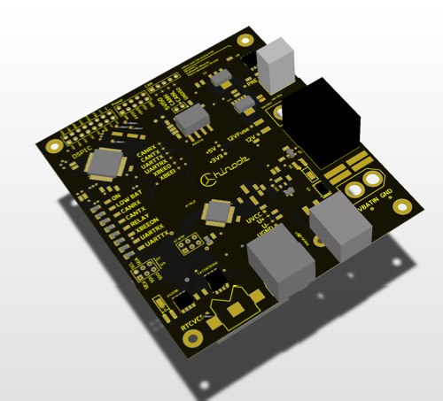

Fujin
=====

Fujin: calculation, dataloggin and battery monitoring system

Fūjin (風神?) or Futen is also the Japanese god of the wind and one of the eldest Shinto gods. (source [wikipedia](https://en.wikipedia.org/wiki/F%C5%ABjin))

Part of: [Chinook](http://chinook.etsmtl.ca) wind-powered vehicule. 

  
Features
--------

- **MCU** : dsPIC33EP512MC806
- **Battery Monitoring** : LM4151
- **Datalogging** : SD Card
- **Communication** :
  - **CAN** : iso1050
  - **XBee**
  - **USB-Serial** : atmega16u2
- **RealTimeClock**: DS1338
- **EEPROM** : CAT24C256W

- Power from batteries or USB
- Spare i/o

Pin mapping
-----------

- UART (XBEE) 
  - RP96 (tx)
  - RP97 (rx)
- UART (ATMEGA)
  - RP101 (tx) 
  - RP100 (rx)
- I2C (I2C1) 
  - SCL1 (R62) 
  - SDA1 (R63)
- SPI (SPI2)
  - SCA2/RG6 (SCA)
  - SDI2/RG7 (SDI)
  - SDO2/RG8 (SDO)
- CAN
  - RP99 (rx)
  - RP98 (rx)
- Misc
  - (sdcs)
  - (eeprom)

Peripheral mapping
------------------

- UART
  - XBee
- UART 
  - Atmega
- I2C1
  - RTC (DS1338)
  - EEPROM (CAT24C256W)
  - Voltage Monitor (LM4151)
- SPI2
  - SDCARD
- CAN (ISO1050)
- LEDs
  - RB11 (on)
  - RB12 (lowbat)
  - RB13 (canrx)
  - RB14 (cantx)
  - RB15 (relay)

I2C ADDRESS
-----------

- EEPROM        : 1010000
- RTC           : 1101111
- Power Monitor : 1101000
